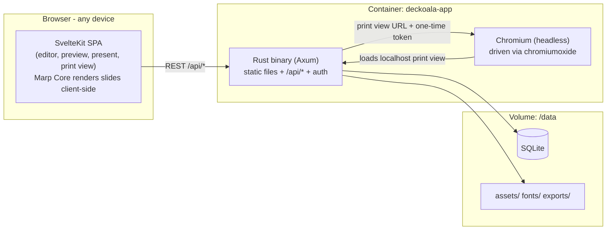
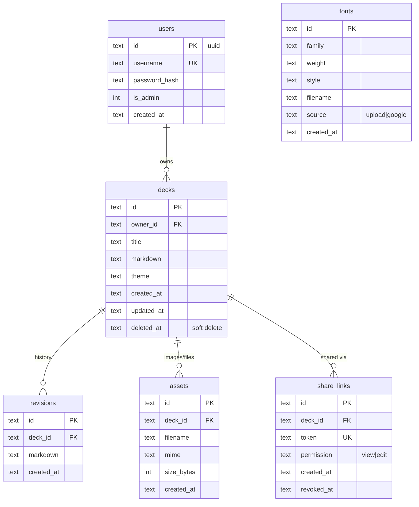

# Deckoala — Architecture

> Locked by ADR-0001 (stack), ADR-0002 (slide engine), ADR-0003 (PDF export). Briefs reference sections here by number.

## 1. System overview



- One container, one volume, one network. Reverse proxy (user's own Caddy/Traefik/NPM) points `deckoala.dimenshade.com` at the published port.
- The backend never renders slides; Marp Core runs only in the browser (including inside headless Chromium for PDF).

## 2. Repository layout

```
deckoala/
  frontend/          # SvelteKit (Svelte 5 + TS), adapter-static
  backend/           # Rust: Axum server (crate name: deckoala-server)
  assets/brand/      # logo.svg, logo-dark.svg (copied into frontend/static at build)
  compose.yml
  Dockerfile         # multi-stage: node build -> cargo build -> debian slim + chromium
  .env.example
  docs/ decisions/   # design side (this documentation)
```

## 3. Frontend (SvelteKit SPA)

- Svelte 5 + TypeScript, `adapter-static` (SPA fallback `index.html`), no SSR.
- Routes (SPA): `/` landing → `/app` dashboard → `/app/deck/{id}` editor → `/present/{id}` → `/print/{id}` (Chromium-only target) → `/s/{token}` shared view.
- Editor: CodeMirror 6 (markdown), split pane with debounced Marp Core render; slide thumbnail rail (drag = reorder slide sections in the markdown, ADR scope: phase-1 drag & drop).
- Preview/present/print all call the same `renderDeck(markdown, themeCss, fontsCss)` module → WYSIWYG parity.
- Default theme `deckoala`: background `#F8F8FF`, ink `#0B1215`, fonts bundled at build: Inter + Noto Sans Thai (no external font requests by default).
- Math: KaTeX via marp-core built-in.

## 4. Backend (Rust / Axum)

- Axum + tokio; sqlx (SQLite, WAL mode); argon2id password hashing; cookie sessions (HttpOnly, SameSite=Lax, 30-day inactivity expiry) via tower-sessions (SQLite store); CSRF defense = same-origin check on mutating routes (reject foreign `Origin` headers; SameSite=Lax covers the rest) `[STD]` per BRIEF-0001.
- Serves: static SPA build (with SPA fallback), `/api/*` JSON, `/data`-backed files (`/assets/{deck}/{file}`, `/fonts/{file}`, `/api/fonts.css`).
- PDF: `chromiumoxide` → opens `http://127.0.0.1:8080/print/{deck}?token={one-time}` → waits for `window.__DECKOALA_PRINT_READY` + `document.fonts.ready` → `Page.printToPDF` sized 1280×720. Chromium may only ever load 127.0.0.1 URLs (ADR-0003 contract).
- Config env: `DECKOALA_DATA_DIR` (default `/data`), `DECKOALA_BIND` (default `0.0.0.0:8080`), `DECKOALA_STATIC_DIR` (default `./static`; the Dockerfile copies the SvelteKit build there — `cargo run` in dev serves no SPA, Vite covers it), `DECKOALA_PUBLIC_URL`, `CHROME_BIN`, `DECKOALA_ALLOW_SIGNUP` (default `true`; admin can later disable).
- Reserved URL prefixes (ADR-0001 contract): `/api/`, `/assets/`, `/fonts/` belong to the backend; the SPA `index.html` fallback applies only to routes outside these prefixes.

## 5. Data model (ERD)



Cross-cutting invariants from day 1: every deck row is owner-scoped (all queries filter by owner or a valid share token); soft delete on decks (`deleted_at`); timestamps are UTC RFC3339 text; every UI page is responsive (desktop/tablet/mobile — `[SRC]` M10) and each UI brief's verification includes a mobile-viewport check.

## 6. Key flows

1. **Edit + live preview** — CodeMirror change → debounce ~150ms → Marp render into preview pane. Autosave: dirty state → `PATCH /api/decks/{id}` `{markdown}` (debounced ~2s; the general update endpoint from BRIEF-0002); server snapshots a `revisions` row at most every 5 minutes of changes.
2. **Duplicate / file ops** — `POST /api/decks/{id}/duplicate` copies deck + assets. Import `.md` / export `.md` endpoints (Marp Markdown is the durable format, ADR-0002 contract).
3. **Present** — `/present/{id}` fullscreen; keys (←/→/Space/Esc), touch swipe; speaker notes from HTML comments; presenter view (notes + next slide + clock) ships with BRIEF-0005.
4. **PDF export** — button → `POST /api/decks/{id}/export/pdf` → chromiumoxide flow (§4) → streams PDF; cached under `/data/exports` keyed by deck revision.
5. **Fonts** — instance-level (Q5 [STD]): upload `.ttf/.woff2` or search Google Fonts by name → backend downloads variants into `/data/fonts` → `/api/fonts.css` emits `@font-face` for all installed fonts → deck frontmatter picks `fontFamily`. Self-contained: viewers never hit external CDNs.
6. **Sharing** — owner mints `share_links` token (`view` or `edit`) → `/s/{token}`; `view` renders deck read-only, `edit` opens editor bound to the token, no account needed. Tokens revocable.

## 7. Ports & isolation (compose)

- Compose project name `deckoala`; service `app`; container `deckoala-app`; network `deckoala-net`; volume `deckoala-data` → `/data`.
- Host port `${DECKOALA_PORT:-8321} -> 8080`. No other ports. Pinned image tags in Dockerfile.

```yaml
# compose.yml (target shape)
services:
  app:
    build: .            # published image later: ghcr.io/<owner>/deckoala (roadmap)
    container_name: deckoala-app
    ports: ["${DECKOALA_PORT:-8321}:8080"]
    volumes: [deckoala-data:/data]
    networks: [deckoala-net]
    restart: unless-stopped
volumes: { deckoala-data: {} }
networks: { deckoala-net: {} }
```

## 8. Build order (brief roadmap)

| # | Unit | Depends on |
|---|---|---|
| BRIEF-0000 | Infra & scaffolding (this repo runs) | — |
| BRIEF-0001 | Auth & users (register/login/session) | 0000 |
| BRIEF-0002 | Deck CRUD + dashboard (list/create/rename/duplicate/soft-delete/import/export .md) | 0001 |
| BRIEF-0003 | Editor + Marp live preview + autosave + revisions | 0002 |
| BRIEF-0004 | Slide rail drag & drop reorder + image asset upload (drop/paste) | 0003 |
| BRIEF-0005 | Present mode + speaker notes + presenter view | 0003 |
| BRIEF-0006 | PDF export via Chromium | 0003 |
| BRIEF-0007 | Font manager (upload + Google Fonts fetch) | 0003 |
| BRIEF-0008 | Sharing (share links view/edit) | 0002 |
| BRIEF-0009 | Polish: Thai UI i18n (+ any nice-to-haves the user approves from REQ-ANALYSIS §7) | rest |
| BRIEF-0010 | Admin settings + `root` bootstrap + AI slide generation (new user requirement) | 0002 |
| BRIEF-0011 | MCP server + per-user API tokens (connect an external AI client) | 0010 |
| BRIEF-0009b | Command palette + keyboard shortcuts (REQ-ANALYSIS §7) | 0009 |
| BRIEF-0009c | Theme gallery + per-deck custom CSS + safe frontmatter writer (REQ-ANALYSIS §7) | 0009 |
| BRIEF-0009d | In-app slide guide (usage manual) + easier image insertion (user request) | 0009c |
| BRIEF-0012 | Visual editor, phase 2: formatting toolbar + block inserter (`[USER]` Q3 deferral) | 0009d |
| BRIEF-0013 | Gemini as a third AI provider (user request) | 0010 |
| BRIEF-0014 | Research library: server-side PDF/text extraction as AI source context + figure extraction (image picker + MCP) | 0013, 0011 |

Briefs are written one (or a small buffer) at a time by the design side; only BRIEF-0000 exists so far.
